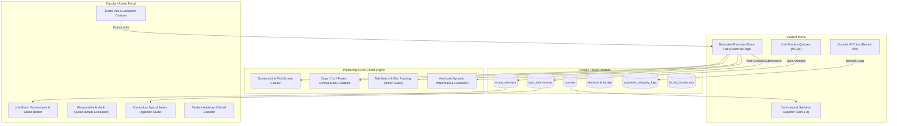

# 🎓 AISA — AI-Powered Student Assistant & Academic Governance Platform

[](https://react.dev/)
[](https://vitejs.dev/)
[](https://ai.google.dev/)
[](https://firebase.google.com/)
[](https://tailwindcss.com/)
[](LICENSE)

> **AISA** is an enterprise-grade university learning and examination platform built for Computer Science & Engineering students and faculty. It uniquely combines an **AI Socratic Tutor (powered by Google Gemini)**, **anti-cheating automated exam lockouts**, **human-in-the-loop faculty escalation**, **interactive multi-format assessments (MCQs, Match the Following, Assertion & Reasoning)**, and a **dedicated full-screen proctored Examination Hall** with real-time sync to **Google Cloud Firestore**.

---

## 👥 Teammates Quick Guide: What is this Project?

If you are new to the team or evaluating this codebase, here is the quick 1-minute summary:

1. **The Problem:** Modern engineering students use AI tools (ChatGPT, etc.) that simply give them direct answers to homework and test questions without conceptual understanding. During exams, students can cheat or copy paste answers. Faculty members have zero visibility into what AI is teaching students.
2. **The AISA Solution:**
   - **Socratic AI (Not Spoon-Feeding):** The AI never reveals direct answers. Instead, it asks leading questions, references approved university textbooks, and guides students step-by-step.
   - **Exam Hall Lockdown:** During exam windows, AI queries are completely frozen ($\pm$30 min buffer).
   - **Dedicated Proctored Exam Hall:** Students take full midterm exams with **MCQs**, **Match the Following (dual-column)**, and **Assertion & Reasoning** in a locked-down, full-screen environment where **screenshots, copy-paste, right-click, devtools, and tab switching are strictly blocked**.
   - **Instant Report Card & Cloud Firestore Sync:** Student exam submissions are automatically graded, an authenticated Report Card is generated, and all attempts are permanently saved in Firebase Cloud Firestore.
   - **Faculty Governance Studio:** Teachers can inspect flagged AI doubts, answer difficult questions, upload syllabus PDFs, broadcast study guides, and review student exam results in real time.

---

## 🏗️ System Architecture & Data Flow



---

## 🌟 Core Features in Detail

### 1. 🏛️ Dedicated Proctored Examination Hall (`ExamHallPage.jsx`)
A dedicated, full-screen examination environment designed to replicate official university tests (TCS iON / Pearson VUE style):
- **3-Tier Sectional Multi-Format Papers**:
  - **Section A: MCQs (12 Marks)** — Conceptual multiple-choice questions with real-time selection.
  - **Section B: Match the Following (10 Marks)** — Interactive dual-column pairing (Column A ➔ Column B) with dynamic connection badges and unlink options.
  - **Section C: Assertion & Reasoning (8 Marks)** — Formal university assertion vs. reasoning comparative problems.
- **Strict Anti-Cheating & Proctoring Lock**:
  - 🚫 **Screenshot Blocked:** Intercepts `PrintScreen`, Mac `Cmd+Shift+3/4/5`, and Windows Snipping Tool `Win+Shift+S`. If triggered, an emergency red shield blanks out the questions, empties the clipboard, and logs a strike.
  - 🚫 **Print Blocked:** `Ctrl+P` / `Cmd+P` blocked. CSS `@media print` completely hides the test.
  - 🚫 **Copy / Paste / Cut Disabled:** `Ctrl+C`, `Ctrl+V`, `Ctrl+X`, and right-click context menu are disabled.
  - 🚫 **Text Selection Disabled:** CSS `user-select: none` prevents copying question statements.
  - 🚫 **DevTools Blocked:** `F12`, `Ctrl+Shift+I`, `Ctrl+Shift+J`, and `Ctrl+U` are disabled.
  - 👁️ **Tab-Switch & Blur Tracking:** Switching browser tabs or minimizing the window triggers an immediate violation strike modal.
  - 💧 **Dynamic Anti-Leak Watermark:** The student's name, roll number, and course code are watermarked across the screen to prevent phone camera leaks.
  - 🖥️ **Fullscreen Mode:** Toggleable fullscreen with re-entry prompts if exited.
- **Auto-Grading & Authenticated Report Card**:
  - Instant calculation of total score (out of 30), percentage, and letter grade (**A+**, **A**, **B**, **C**, **F**).
  - Section-by-section breakdown progress bars.
  - Question-by-question review comparing student's answer with faculty correct key and detailed explanations.
  - One-click print/download report card certificate.
  - Automatic synchronization to Firestore collection `exam_attempts`.

---

### 2. 🧠 Socratic AI Tutor (`geminiService.js`)
- Integrated with **Google Gemini Flash & Pro** models.
- **Socratic Pedagogy:** When a student asks *"Solve this problem for me"*, the AI does not give the final code or answer. It responds with conceptual hints, textbook proofs, and asks guiding questions.
- **Multi-Model Fallback:** Automatic cascading fallback (`gemini-flash-latest` ➔ `gemini-2.5-flash` ➔ `gemini-2.5-pro` ➔ local offline academic generator) ensures 100% uptime.
- **Code & Formula Rendering:** Markdown, syntax-highlighted code blocks, and copy helpers.

---

### 3. 🛡️ Exam Lockdown System (`examLockService.js`)
- **Automated Buffer Policy:** University exam periods are automatically ring-fenced with a $\pm$30-minute pre- and post-exam lockdown window.
- **Live Countdown & Input Freezing:** Students see a ticking countdown banner. During active exams, the AI chat input is locked with a warning notice.
- **Teacher Emergency Override:** Faculty can force-lock or unlock any exam window with 1 click.

---

### 4. 👩‍🏫 Human-in-the-Loop Doubt Escalation (`aiAuditData.js`)
- If the AI gives an ambiguous response or a student needs help, they click **"Ask Teacher"**.
- Students can submit a personalized note and thumbs up/down rating.
- Faculty receives the doubt in their **Responsible AI Audit Queue**, reviews the forensic transcript, and types an official verified reply.
- The student's chat drawer updates with an official **"🎓 Verified Faculty Answer"** badge.

---

### 5. 📚 Curriculum & Notes Ingestion Studio (`notesBroadcastService.js`)
- Complete **8-Semester B.Tech CSE Curriculum** with subject units, syllabus descriptions, and verified textbook references.
- Faculty can drag-and-drop syllabus PDFs or lecture notes into the ingestion studio.
- AI Study Notes Generator: Faculty can generate high-yield revision summaries and broadcast them to all enrolled students with 1 click.
- Automated email alert builder: Pre-populates academic review letters with student CGPA, attendance, and exam scores ready to dispatch via native mail or Gmail.

---

### 6. ☁️ Google Cloud Firestore Database
The platform is powered by live Cloud Firestore synchronization with 10 collections:

| Collection Name | Purpose |
|---|---|
| `courses` | Curriculum taxonomy, units, and textbook references |
| `quiz_submissions` | Student practice quiz scores, percentages, and timestamps |
| `exam_attempts` | Full proctored midterm submissions, sectional marks, student answers, and proctoring flags |
| `students` | Enrolled student profiles, academic performance, and attendance |
| `faculty` | Faculty profiles, departmental designations, and office hours |
| `academic_integrity_logs` | Real-time tab-switch violations and anti-cheat triggers |
| `chat_sessions` | Socratic AI chat messages and student queries |
| `faculty_broadcasts` | Study guides and notices published by teachers |
| `doubts_escalated` | Doubts escalated by students for human faculty review |
| `exam_locks` | University examination schedules and automated lockdown buffers |

---

## 📖 Granular Page-by-Page Breakdown (Har Ek Page Ka Deep Dive)

Here is an exhaustive, element-by-element explanation of every single page and modal in the AISA platform:

```
+---------------------------------------------------------------------------------------------------+
|                                      APPLICATION ROUTE MAP                                       |
+---------------------------------------------------------------------------------------------------+
|  1. LandingPage ('landing')           -> Public University Portal (Hero, Accreditations, Modules) |
|  2. LoginPage ('login')               -> Student Auth (Google OAuth, Email/Pass, 1-Click Demo)    |
|  3. AdminLoginPage ('admin_login')    -> Faculty Auth (Department Chair Demo, Verification)       |
|  4. DashboardPage ('dashboard')       -> Student Hub (Semesters, Subjects, AI Chat, Exam Banner)  |
|  5. ExamHallPage ('exam_hall')        -> Fullscreen Proctored Exam Room (Anti-Cheat, Report Card) |
|  6. AdminDashboardPage ('admin_dash') -> Faculty Studio (Locks, Audit Queue, Ingestion, Roster)   |
|  7. SubjectQuizModal (Modal)          -> Subject Practice MCQs with Instant Firestore Sync        |
|  8. StudentNotesHub (Modal/View)      -> Faculty Broadcast Study Guides & PDF Downloads           |
+---------------------------------------------------------------------------------------------------+
```

---

### 1️⃣ Page 1: `LandingPage.jsx` — Public University Front Portal
- **Route:** `currentScreen === 'landing'`
- **Purpose:** The official public gateway for students, prospective applicants, and accreditation committees.
- **Key Elements & Features:**
  - **3D Interactive Hero Canvas:** Built using Three.js / WebGL, displaying an animated floating university emblem with interactive mouse hover effects.
  - **Hero Header & Tagline:** *"Next-Generation AI Learning Platform Engineered for Engineering Universities"*.
  - **Live Floating Badges:** Dynamic floating pill chips showcasing *"Verified Syllabus Units"*, *"AI Socratic Tutor Active"*, and *"Anti-Cheating Honor Guard"*.
  - **Showcase Video Banner:** Embedded university demonstration video showcasing the Socratic AI interaction.
  - **Role Action Buttons:**
    - **"Student Portal →"**: Navigates directly to `login`.
    - **"Faculty / Admin Portal →"**: Navigates to `admin_login`.
  - **Problem vs. Solution Comparison Matrix:** Side-by-side comparison explaining why standard ChatGPT harms academic learning (spoon-feeding direct answers) vs. how AISA reinforces learning through Socratic questioning.
  - **8-Semester Curriculum Preview:** Interactive carousel displaying Semester 1 through Semester 8 course titles (Calculus, Data Structures, DBMS, AI/ML, Operating Systems, Computer Networks).
  - **Footer:** Accreditation badges, institutional contact information, and copyright notice.

---

### 2️⃣ Page 2: `LoginPage.jsx` — Student Authentication Portal
- **Route:** `currentScreen === 'login'`
- **Purpose:** Authenticates enrolled students and loads their personalized academic records.
- **Key Elements & Features:**
  - **Institutional Login Form:** Clean card design with Email and Password input fields.
  - **Google OAuth 2.0 Sign-In:** One-click login with university Google accounts (`signInWithPopup` via Firebase Auth).
  - **⚡ 1-Click Quick Demo Login Button:** Instant presentation button preloading the profile of **Aditi Sharma** (`aditi.sharma@univ.edu`, Roll: `22BCS10492`, 3rd Year B.Tech CSE). This allows instant logins during project evaluations without typing credentials.
  - **Form Validation & Safety:** Error toast alert if credentials are invalid.
  - **"← Back to Overview"** button returning to `landing`.

---

### 3️⃣ Page 3: `AdminLoginPage.jsx` — Faculty & Administrator Access Portal
- **Route:** `currentScreen === 'admin_login'`
- **Purpose:** Secure authentication portal for university professors, department heads, and academic deans.
- **Key Elements & Features:**
  - **High-Security Institutional Card:** Distinctive dark slate and gold aesthetic denoting administrative privileges.
  - **Department Selector:** Pre-selected to *Department of Computer Science & Engineering*.
  - **⚡ 1-Click Faculty Demo Login Button:** Instantly signs in as **Dr. Rajesh Kumar** (`rajesh.kumar@univ.edu`, Faculty ID: `FAC-8092`, Department Chair).
  - **Security Warning Notice:** Informs users that all administrative actions (exam locks, notes publishing, student email alerts) are audit-logged.
  - **"← Back to Public Portal"** button returning to `landing`.

---

### 4️⃣ Page 4: `DashboardPage.jsx` — Student Learning Hub & Socratic AI Drawer
- **Route:** `currentScreen === 'dashboard'`
- **Purpose:** The core daily workspace for students to explore their syllabus, practice unit MCQs, enter exams, and receive Socratic tutoring.
- **Layout Structure:**
  - **A. Header Bar:**
    - Displays Student Name, Roll Number, Academic Year, and active semester.
    - **Live Exam Lockout Warning Banner:** If an exam is currently active or scheduled within 30 minutes, a prominent ticking countdown banner informs the student that AI queries are restricted.
    - Logout button.
  - **B. Step 1 — Semester Grid View (`currentStep === 'semesters'`):**
    - Cards for Semesters 1 to 8.
    - Shows total credits, subjects count, and status (*Open* for Sem 1-6, *Locked / Upcoming* for Sem 7-8).
    - Clicking a semester smoothly transitions to Step 2.
  - **C. Step 2 — Subject Cards View (`currentStep === 'subjects'`):**
    - Subject category filters: *All*, *Core*, *Programming*, *Web & Systems*, *Labs*.
    - Search input to filter subjects by code or title in real-time.
    - **Subject Card Action Buttons:**
      - **"Syllabus →"**: Opens the detailed unit breakdown.
      - **"MCQs"**: Instantly launches `SubjectQuizModal` for that subject.
      - **"Exam"**: If the subject has an official exam paper (e.g. `CS204` DBMS or `CS203` DSA), launches the dedicated proctored exam hall.
  - **D. Step 3 — Subject Detail View (`currentStep === 'subject_detail'`):**
    - Subject Hero Header with course title, code, and credits.
    - **"Approved Textbook References"** section: Official recommended books (e.g. Korth & Silberschatz for DBMS, Cormen for DSA).
    - **Syllabus Units Accordion (Unit 1 to Unit 5):** Complete syllabus topics, key definitions, and formal mathematical proofs.
    - Action buttons: *"Take Practice MCQs"*, *"Enter Proctored Exam"*, and *"Launch AI Socratic Tutor"*.
  - **E. 🏛️ Apex Proctored Midterm Examination Portal (Hero Banner):**
    - Royal indigo/violet card displaying available midterm exam papers.
    - Quick paper selector: `CS204: DBMS (20m)` vs `CS203: DSA (20m)`.
    - **"Enter Examination Hall →"** button: Navigates full-screen into `ExamHallPage`.
    - **"My Proctored Exam Records"**: Displays student's past completed attempts with Letter Grade badge (`A+`, `A`, `B`, `F`), score out of 30, submission timestamp, and Firestore cloud confirmation.
  - **F. Cloud Practice Quiz Performance Section:**
    - Live sync with Firestore collection `quiz_submissions`.
    - Displays recent quiz attempts with score, percentage, and date.
  - **G. Right-Side Socratic AI Drawer (`isChatOpen`):**
    - Slide-out interactive chat assistant powered by Google Gemini.
    - **Socratic Logic:** Rejects direct answer queries; prompts students with guiding hints.
    - **Code & LaTeX Support:** Markdown rendering with syntax highlighting and copy code helper.
    - **"Ask Teacher" Doubt Escalation Button:** Placed under each AI message. Allows students to report hallucinations or request faculty help.
    - **"🎓 Verified Faculty Answer"** badge appears when a teacher resolves the doubt.

---

### 5️⃣ Page 5: `ExamHallPage.jsx` — Dedicated Full-Screen Proctored Examination Hall
- **Route:** `currentScreen === 'exam_hall'`
- **Purpose:** A dedicated, distraction-free examination room with maximum anti-cheating security. Replaces normal modals with an official full-screen exam interface.
- **Anti-Cheating Security Protections:**
  - 🚫 **Screenshot & Screen Capture Blocker:**
    - Intercepts Windows `PrintScreen` (keycode 44).
    - Intercepts Mac screenshot shortcuts: `Cmd + Shift + 3`, `Cmd + Shift + 4`, `Cmd + Shift + 5`.
    - Intercepts Windows Snipping Tool: `Win + Shift + S` and `Ctrl + Shift + S`.
    - **Emergency Screen Shield:** If any screenshot key is pressed, an emergency red overlay flashes, blurs all questions, wipes the clipboard via `navigator.clipboard.writeText('')`, and records a strike.
  - 🚫 **Print Blocker:** `Ctrl+P` / `Cmd+P` blocked. CSS `@media print` hides all questions and renders a violation warning.
  - 🚫 **Copy / Cut / Paste Blocked:** `Ctrl+C`, `Ctrl+V`, `Ctrl+X`, and right-click copy are blocked with alert toasts.
  - 🚫 **Text Selection Disabled:** CSS `user-select: none` and `selectstart` event prevent selecting any question text.
  - 🚫 **Right-Click Disabled:** Context menu is blocked with a security warning toast.
  - 🚫 **DevTools Blocked:** `F12`, `Ctrl+Shift+I`, `Ctrl+Shift+J`, and `Ctrl+U` are disabled.
  - 👁️ **Tab-Switch & Blur Tracking:** Switching browser tabs or minimizing the browser opens an **Honor Guard Violation Modal** and logs strikes.
  - 💧 **Dynamic Anti-Leak Watermark:** The student's name, roll number, and course code repeat diagonally across the background to prevent phone camera leaks.
  - 🖥️ **Fullscreen Mode:** One-click fullscreen toggle with warning banners if exited.
- **Examination Layout:**
  - **Top Bar:** Exam Code, Course Title, Candidate Name, Roll Number, Lockdown Status badge, Fullscreen button, and Countdown Timer (red pulse when < 5 mins).
  - **Left Sidebar:** Candidate ID card with photo avatar, Section switcher (Sec A, Sec B, Sec C), Question Palette grid (1 to 6 with color indicators: Answered, Review, Unanswered, Active), and "Submit Final Paper" button.
  - **Center Canvas (Multi-Format Question Renderers):**
    - **Section A (MCQs - 12 Marks):** Radio option cards with hover and active states.
    - **Section B (Match the Following - 10 Marks):** Interactive dual columns (Column A & Column B). Students click an item in Column A (amber highlight), then click its pair in Column B (emerald link badge). Includes unlink option.
    - **Section C (Assertion & Reasoning - 8 Marks):** Dual Assertion (A) and Reason (R) cards with standard 4 university options.
  - **Bottom Navigation:** *"Previous"*, *"Mark for Review & Next"*, *"Clear Answer"*, and *"Save & Next"*.
- **Auto-Grading & Post-Submission Report Card:**
  - Confetti celebration upon submission.
  - Letter Grade badge (**A+**, **A**, **B**, **C**, **F**), Total Score (out of 30), and Percentage.
  - Sectional breakdown progress bars (Sec A: 12m, Sec B: 10m, Sec C: 8m).
  - Full Question-by-Question Review with faculty answers and detailed explanations.
  - One-click print/download report card button (`window.print()`).
  - Automatic permanent sync to Cloud Firestore collection `exam_attempts`.
  - *"Return to Student Dashboard"* button.

---

### 6️⃣ Modal: `SubjectQuizModal.jsx` — Unit Practice Quiz Modal
- **Trigger:** Click **"MCQs"** on any subject card or **"Take Practice Quiz"** banner.
- **Purpose:** Quick self-assessment testing conceptual clarity on specific subject units.
- **Key Elements & Features:**
  - 3-5 randomized conceptual MCQs tailored to the chosen course.
  - Radio button options with immediate answer tracking.
  - Live progress meter (Question X of Y).
  - Submission auto-grading: Displays score, percentage, and pass/fail indicator.
  - Permanent synchronization to Cloud Firestore collection `quiz_submissions`.

---

### 7️⃣ Page 7: `AdminDashboardPage.jsx` — Faculty Governance, Lockdown Controls & Roster
- **Route:** `currentScreen === 'admin_dashboard'`
- **Purpose:** Complete command center for faculty and department chairs to manage exams, view student submissions, resolve doubts, and ingest syllabus materials.
- **4 Main Management Tabs:**
  - **Tab 1: 🔒 Exam Hall & Lockdown Controls:**
    - Live counters: Active Exam Locks, Scheduled Exams, Pending AI Flags.
    - **Scheduled Exam Windows Table:** Lists upcoming exam dates, start times, and end times.
    - **Force Lock / Unlock Override:** Teachers can manually trigger an exam lockout at any time with 1 click.
    - **"Schedule New Exam Window" Form:** Teachers can set up new examination timetables with date, start time, end time, course, and department.
    - **🏛️ Live Proctored Examination Submissions Roster:**
      - Real-time table synced directly from Cloud Firestore collection `exam_attempts`.
      - Displays: Student Name & Email, Exam Paper Code, Score out of 30, Letter Grade badge (`A+`, `A`, `B`, `C`, `F`), Sectional Breakdown (MCQ, Match, Assertion), Time Taken, Anti-Cheating Tab-Switch Violations count, Timestamp, and Firestore Document ID.
  - **Tab 2: ⚖️ Responsible AI Audit Queue:**
    - Displays all doubts escalated by students who clicked *"Ask Teacher"* in the AI chat.
    - Filters: *All*, *Pending Review*, *Resolved*.
    - **Forensic Dossier Modal:** Shows the student's exact prompt, the AI's response, student's personal notes, and hallucination feedback.
    - **Faculty Verified Reply Composer:** Teachers type their authoritative solution and click dispatch. It instantly appears in the student's chat drawer with a verified faculty seal.
  - **Tab 3: 📁 Curriculum & Notes Studio (RAG Ingestion):**
    - Drag-and-drop syllabus PDF and lecture notes upload dropzone with 0% to 100% animated progress meter.
    - **AI Study Notes Generator:** Automatically analyzes uploaded notes and synthesizes a high-yield study guide.
    - **Cohort Broadcast Button:** Pushes the generated notes directly into every student's *StudentNotesHub*.
    - **"Sync to Firestore" Button:** Syncs all curriculum courses to Firestore collection `courses`.
  - **Tab 4: 👥 Student Directory & Academic Performance Roster:**
    - Directory of 42 student profiles with CGPA, attendance, semester, and academic status (*Top Performer*, *On Track*, *Needs Support*).
    - **Student Details Modal:** Displays student's enrolled courses, attendance, continuous assessment marks, practice quiz scores, and proctored exam transcripts.
    - **1-Click Performance Email Dispatcher:** Pre-writes a detailed academic performance letter and provides buttons to open in default mail client (`mailto:`) or open directly in Gmail Web compose.

---

### 8️⃣ Component: `StudentNotesHub.jsx` — Notes & Revision Hub
- **Purpose:** Student library for downloading syllabus reference sheets and faculty study guides.
- **Key Elements & Features:**
  - Course-wise document filtering.
  - PDF preview and download buttons.
  - Real-time notification toast when faculty broadcasts new notes from the Admin studio.

---

### 9️⃣ Components: `Navbar.jsx` & `ScrollProgress.jsx` — Navigation & Status
- **Purpose:** Persistent top navigation bar and reading progress meter.
- **Key Elements & Features:**
  - **Thin Gold Scroll Progress Bar (`ScrollProgress.jsx`):** Smoothly indicates scroll progress on long landing pages.
  - **Institutional Branding & Logo:** Apex Institute of Science & Technology crest.
  - **Portal Role Switcher:** Quick switching between Student Portal and Faculty / Admin Portal.
  - **Live Exam Lockdown Indicator:** Shows whether campus examination lockdown is active.

---

## 💻 Step-by-Step Setup Guide (For Teammates)

Follow these steps to run the complete project on your computer:

### Step 1: Prerequisites
Make sure you have Node.js installed (v18 or higher recommended):
```bash
node -v
npm -v
```

### Step 2: Clone the Repository
```bash
git clone https://github.com/Sahilp2407/AISA-Learning-.git
cd AISA-Learning-
```

### Step 3: Install Dependencies
```bash
npm install
```

### Step 4: Configure Environment Variables
Create a `.env` file in the root directory:
```bash
cp .env.example .env
```
Open `.env` and verify your Google Gemini API key:
```env
VITE_GEMINI_API_KEY=your_gemini_api_key_here
```
*(You can get a free API key in 30 seconds from [Google AI Studio](https://aistudio.google.com/). The app also includes built-in offline fallbacks if an API key is not supplied).*

### Step 5: Start the Development Server
```bash
npm run dev
```
Open your browser and visit: **`http://localhost:5173`**

### Step 6: Build for Production (Optional Verification)
```bash
npm run build
```

---

## 🔑 Demo Login Credentials

The platform includes convenient 1-click demo logins so you never have to type passwords during testing or presentations:

| Portal | Role | Email | Features to Test |
|---|---|---|---|
| **Student Portal** | Student (3rd Year CSE) | `aditi.sharma@univ.edu` | • Socratic AI Tutor<br>• Practice MCQs<br>• Proctored Examination Hall<br>• View Performance Report Cards |
| **Faculty Admin Portal** | Department Chair | `rajesh.kumar@univ.edu` | • Exam Hall Lockouts & Timetable<br>• Live Exam Submissions Roster<br>• Responsible AI Audit Queue<br>• Notes & Syllabus Ingestion |

---

## 📂 Project Directory Structure

```
AISA-Learning-/
├── public/                               # Static assets and demo media
├── src/
│   ├── assets/                           # Static brand illustrations and photos
│   ├── components/
│   │   ├── ExamHallPage.jsx              # Dedicated full-screen Proctored Exam Hall
│   │   ├── ExaminationModal.jsx          # Proctored Exam Modal & Report Card
│   │   ├── SubjectQuizModal.jsx          # Unit Practice Quiz Modal (MCQs)
│   │   ├── DashboardPage.jsx             # Student Dashboard & Socratic AI Drawer
│   │   ├── AdminDashboardPage.jsx        # Faculty Governance & Examination Studio
│   │   ├── LandingPage.jsx               # Public university landing page
│   │   ├── LoginPage.jsx                 # Student login with Google OAuth & Demo buttons
│   │   ├── AdminLoginPage.jsx            # Faculty login with Demo credentials
│   │   ├── Navbar.jsx                    # Header with role switchers & lock status
│   │   ├── StudentNotesHub.jsx           # Study materials & broadcast notes viewer
│   │   ├── FormattedChatMessage.jsx      # Markdown, LaTeX, and code block renderer
│   │   ├── ErrorBoundary.jsx             # Global React error catcher
│   │   └── ScrollProgress.jsx            # Gold reading progress bar
│   ├── data/
│   │   ├── examPapersData.js             # Multi-format exam papers (DBMS CS204, DSA CS203)
│   │   ├── curriculumData.js             # Complete Sem 1-8 B.Tech CSE syllabus hierarchy
│   │   ├── studentsData.js               # 42 Student profiles & 8 Faculty records
│   │   └── aiAuditData.js                # AI doubts, hallucination reports & audit dossiers
│   ├── services/
│   │   ├── examService.js                # Auto-grading, scoring & Firestore exam_attempts sync
│   │   ├── assessmentService.js          # Firestore quiz_submissions sync & courses sync
│   │   ├── examLockService.js            # Real-time ±30m exam lockout timing calculations
│   │   ├── geminiService.js              # Google Gemini API integration & cascading fallbacks
│   │   └── notesBroadcastService.js      # Faculty study notes generator & email builder
│   ├── App.jsx                           # Screen router ('landing', 'login', 'dashboard', 'exam_hall', etc.)
│   ├── firebase.js                       # Firebase app initialization, Auth & Firestore db export
│   ├── index.css                         # Tailwind CSS, font imports & anti-screenshot print rules
│   └── main.jsx                          # React application entry point
├── firestore.rules                       # Firestore Security Rules for university collections
├── package.json                          # Dependencies and npm scripts
├── tailwind.config.js                    # Academic color palette (Gold, Charcoal, Ghost White)
├── vite.config.js                        # Vite bundler configuration
└── README.md                             # Comprehensive project documentation
```

---

## 🎯 How to Demonstrate Features (Viva / Demo Script)

Here is a quick walkthrough to demonstrate the project to professors, evaluators, or clients:

1. **Start on Landing Page (`http://localhost:5173`)**:
   - Show the university branding, 3D interactive elements, and course modules.
   - Click **"Student Portal"** (or use 1-click demo login as `Aditi Sharma`).
2. **Student Dashboard & Socratic AI**:
   - Browse **B.Tech CSE Semester 2** and select **CS204 (DBMS)**.
   - Click **"Launch AI Socratic Tutor"** in the sidebar.
   - Ask: *"Explain B+ Trees with an example"*.
   - Notice how the AI guides conceptually without giving direct solutions.
   - Test the **"Ask Teacher"** button to simulate escalating a doubt to faculty.
3. **Dedicated Proctored Exam Hall**:
   - On the student dashboard, look at the **"🏛️ Apex Proctored Midterm Examination Portal"** banner.
   - Click **"Enter Examination Hall"**.
   - Notice the dedicated full-screen layout.
   - **Test Anti-Cheating Protections**:
     - Try right-clicking ➔ Blocked with alert toast.
     - Try selecting question text ➔ Text cannot be highlighted (`user-select: none`).
     - Try pressing `Ctrl+C` or `Cmd+C` ➔ Blocked.
     - Try pressing `PrintScreen` or Mac screenshot shortcut ➔ **Emergency Red Screen Shield flashes, clipboard is cleared, and violation is logged**.
     - Try switching to another browser tab ➔ **Honor Guard Violation Modal pops up**.
   - **Solve the Exam**:
     - Section A: Select an MCQ answer.
     - Section B: Match Column A to Column B (click left item, then click right item).
     - Section C: Solve Assertion & Reasoning.
   - Click **"Submit Final Paper"** ➔ Confetti burst + Instant **Official Student Performance Report Card** with letter grade, sectional marks, faculty explanations, and **Cloud Firestore verification badge**.
4. **Faculty Admin Portal**:
   - Logout and login via **"Faculty / Admin Portal"** (or 1-click login as `Dr. Rajesh Kumar`).
   - Open **"Exam Hall & Lockdown Controls"** tab:
     - View the live **Proctored University Examination Submissions Roster** showing the student's submission, score, letter grade, and cheating violation count!
     - Click **"Force Lock"** on any subject to demonstrate the live countdown and AI chat freeze.
   - Open **"Responsible AI Audit Queue"** tab to see escalated doubts and reply to students.
   - Open **"Curriculum & Notes Studio"** to test drag-and-drop PDF upload and 1-click student advisory email dispatch.

---

## 🛠️ Frequently Asked Questions (Teammate FAQ)

### Q1: Do I need to pay for Firebase or Gemini API?
**No.** Both use 100% free tier. Google Gemini API has a generous free tier for developers, and Firebase Spark Plan (free) easily handles university-scale testing. If you don't have an API key, the app includes built-in offline academic fallbacks so it will never crash.

### Q2: What if Firestore gives a permission-denied error?
The project includes [`firestore.rules`](file:///Users/sahilpandey/Downloads/AISAAAAA/firestore.rules) configured to allow authenticated and student/faculty reads and writes. If you run the app locally without configuring your own Firebase project, the app automatically falls back to an internal persistent `localStorage` mirror so no data is ever lost.

### Q3: How do I change the exam questions?
All university exam papers are located in [`src/data/examPapersData.js`](file:///Users/sahilpandey/Downloads/AISAAAAA/src/data/examPapersData.js). You can edit questions, add more options, or create new course papers easily by adding an object to `UNIVERSITY_EXAMS_DATA`.

---

## 📜 License & Acknowledgments

This project is licensed under the **MIT License** — see the [LICENSE](LICENSE) file for details.

Developed with ❤️ for academic excellence by **Sahil Pandey** ([@Sahilp2407](https://github.com/Sahilp2407)).
